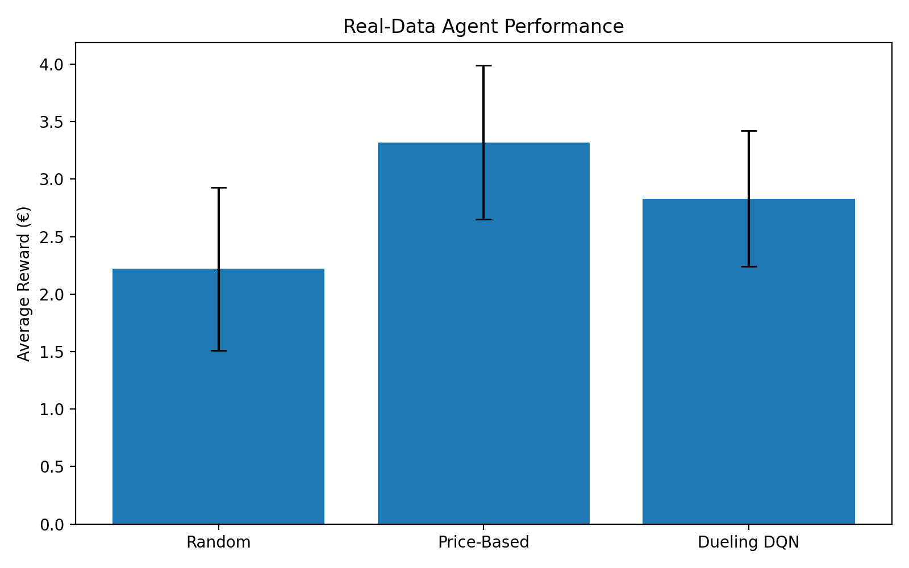
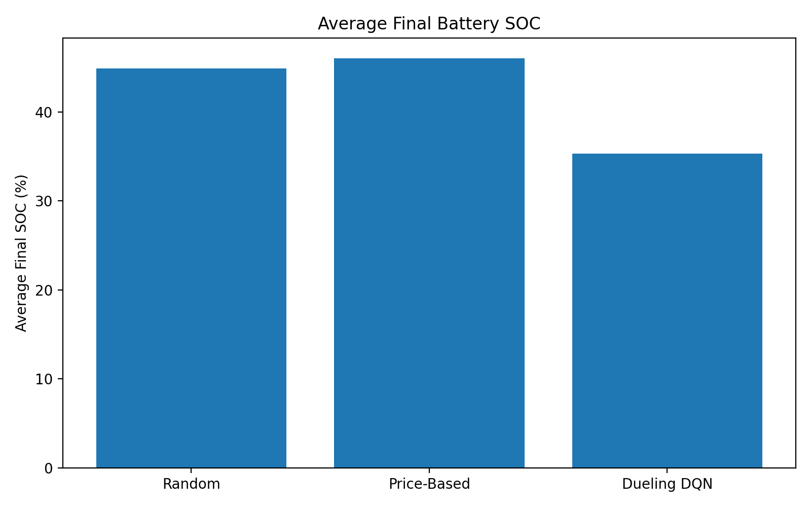
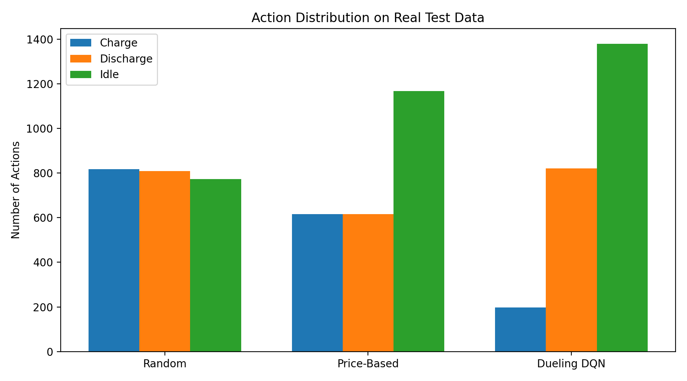

# Energy Storage Arbitrage Using Dueling Deep Q-Network

A reinforcement learning project for optimizing the charging and discharging of an energy storage battery based on electricity market prices.

The project uses a **Dueling Deep Q-Network (Dueling DQN)** to learn battery charging, discharging, and idle decisions from historical electricity price data.

---

## Project Overview

Energy storage systems can store electricity when prices are low and discharge stored energy when prices are higher.

The project includes:

- Battery energy storage simulation
- Electricity price-based environment
- Dueling DQN architecture
- Experience replay
- Target network
- Epsilon-greedy exploration
- Real historical electricity price data
- Train/test data separation
- Random and price-based baseline agents
- Performance evaluation and visualization

---

## System Architecture

```text
Historical Electricity Price Data
              |
              v
       Data Preparation
              |
              v
      Train / Test Split
              |
              v
     Energy Storage Environment
              |
              v
         Battery Model
              |
              v
         Dueling DQN
              |
              v
       Action Selection
        +------+------+
        |      |      |
        v      v      v
      Idle   Charge Discharge
              |
              v
       Battery State Update
              |
              v
            Reward
              |
              v
        Model Training
              |
              v
       Real Test Dataset
              |
              v
        Agent Evaluation
```

---

## Reinforcement Learning Environment

### State

```text
State = [SOC, Electricity Price, Hour]
```

- **SOC** = battery State of Charge
- **Electricity Price** = current electricity market price
- **Hour** = current time step within the day

The price and hour values are normalized before being provided to the neural network.

### Actions

| Action | Description |
|---|---|
| 0 | Idle |
| 1 | Charge |
| 2 | Discharge |

---

## Battery Model

| Parameter | Value |
|---|---:|
| Battery Capacity | 100 kWh |
| Initial Energy | 50 kWh |
| Minimum SOC | 10% |
| Maximum SOC | 90% |
| Maximum Charge Power | 20 kW |
| Maximum Discharge Power | 20 kW |
| Charge Efficiency | 90% |
| Discharge Efficiency | 90% |

---

## Reward Function

Charging produces a negative reward because electricity is purchased.

Discharging produces a positive reward because stored electricity is sold.

Idle produces zero immediate reward.

A terminal battery value is also considered at the end of an episode based on the remaining battery energy and the final electricity price.

---

# Dueling DQN

The main reinforcement learning model is a **Dueling Deep Q-Network**.

The network separates state-value estimation from action-advantage estimation:

```text
                    Input State
                         |
                         v
                 Shared Network
                         |
              +----------+----------+
              |                     |
              v                     v
        Value Stream           Advantage Stream
             V(s)                  A(s,a)
              |                     |
              +----------+----------+
                         |
                         v
              Q(s,a) = V(s)
                     + A(s,a)
                     - mean(A(s,a))
                         |
                         v
                  Action Selection
```

The final Q-value is:

```text
Q(s,a) = V(s) + A(s,a) - mean(A(s,a))
```

The implementation includes:

- Dueling neural network
- Online Q-network
- Target network
- Experience replay buffer
- Epsilon-greedy exploration
- Discount factor
- Adam optimizer
- Periodic target network updates

The trained model is generated locally as:

```text
dueling_dqn_model.pth
```

The model checkpoint is intentionally excluded from GitHub through `.gitignore`.

---

# Dataset

The project uses real historical electricity price data.

The processed data is stored in:

```text
real_train_prices.csv
real_test_prices.csv
```

The test dataset contains:

```text
7,013 records
```

Observed test-data price range:

```text
Minimum: €2.30/MWh
Maximum: €84.13/MWh
Average: €58.25/MWh
```

---

# Training

Train the Dueling DQN with:

```bash
python3 train_dueling_real.py
```

This creates the trained model locally:

```text
dueling_dqn_model.pth
```

The model can then be evaluated with:

```bash
python3 evaluate_dueling_real.py
```

---

# Evaluation

The trained model was evaluated using the separate real test dataset over 100 episodes with 24-hour episodes.

One evaluation run produced:

```text
Average Reward       : €2.94
Standard Deviation   : €0.45
Minimum Reward       : €0.66
Maximum Reward       : €4.11
Average Final SOC    : 33.18%

Charge Actions       : 200
Discharge Actions    : 800
Idle Actions         : 1400
```

The saved result file is generated locally during evaluation and is excluded from GitHub.

---

# Baseline Comparison

The Dueling DQN was compared with:

1. Random Agent
2. Price-Based Agent
3. Dueling DQN

The comparison used 100 test episodes.

| Agent | Average Reward | Std. Dev. | Average Final SOC |
|---|---:|---:|---:|
| Random | €2.22 | €0.71 | 44.92% |
| Price-Based | €3.32 | €0.67 | 46.04% |
| Dueling DQN | €2.83 | €0.59 | 35.32% |

### Action Distribution

| Agent | Charge | Discharge | Idle |
|---|---:|---:|---:|
| Random | 817 | 809 | 774 |
| Price-Based | 616 | 616 | 1168 |
| Dueling DQN | 198 | 822 | 1380 |

These are the results of the final comparison run. The Dueling DQN achieved a higher average reward than the random baseline in this comparison, while the price-based benchmark achieved a higher average reward than the Dueling DQN.

---

# Results

### Average Reward



### Average Final SOC



### Action Distribution



The three images above are included in the repository as the final project result visualizations.

---

# Project Structure

```text
energy-storage-arbitrage/
│
├── battery.py
├── energy_env.py
├── real_data.py
├── real_train_prices.csv
├── real_test_prices.csv
│
├── dueling_dqn.py
├── dueling_dqn_agent.py
├── replay_buffer.py
│
├── train_dueling_real.py
├── evaluate_dueling_real.py
├── diagnose_dueling_real.py
├── compare_real_agents.py
├── final_real_comparison.py
│
├── final_real_reward_comparison.png
├── final_real_soc_comparison.png
├── final_real_action_distribution.png
│
├── requirements.txt
├── README.md
├── .gitignore
└── LICENSE
```

The trained `.pth` model and temporary result files are generated locally and excluded from the repository.

---

# Installation

Clone the repository:

```bash
git clone https://github.com/R-Karthik7/energy-storage-arbitrage.git
```

Move into the project directory:

```bash
cd energy-storage-arbitrage
```

Create a virtual environment:

```bash
python3 -m venv venv
```

Activate it on macOS/Linux:

```bash
source venv/bin/activate
```

On Windows:

```bash
venv\Scripts\activate
```

Install dependencies:

```bash
pip install -r requirements.txt
```

---

# Running the Project

## 1. Train the Dueling DQN

```bash
python3 train_dueling_real.py
```

## 2. Evaluate the trained model

```bash
python3 evaluate_dueling_real.py
```

## 3. Diagnose the learned policy

```bash
python3 diagnose_dueling_real.py
```

## 4. Compare agents

```bash
python3 compare_real_agents.py
```

## 5. Generate the final graphs

```bash
python3 final_real_comparison.py
```

---

# Technologies Used

- Python
- PyTorch
- NumPy
- Pandas
- Matplotlib
- Gymnasium
- Reinforcement Learning
- Deep Q-Learning
- Dueling DQN
- Git
- GitHub

---

# Future Improvements

- Train on a larger historical dataset
- Add multiple electricity markets or pricing locations
- Include renewable generation
- Model battery degradation
- Include price forecasts
- Optimize hyperparameters
- Compare against additional reinforcement learning algorithms
- Build a dashboard for battery operation visualization

---

# Disclaimer

This project is an experimental reinforcement learning simulation for energy storage arbitrage. Results depend on the selected dataset, battery parameters, reward formulation, training configuration, and evaluation methodology.

The project is intended for educational and experimental purposes.
